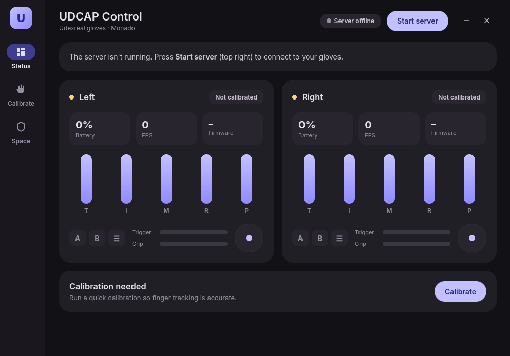

# UDCAP Control



A Tauri 2 + Svelte 5 control panel for UDCAP (Udexreal) VR gloves on Linux/Monado.
It supervises `udcap-server`, shows live glove status, runs guided calibration,
tunes per-finger curl ranges and the per-hand Space Orientation offsets, and maps
the controller inputs — all over the shared-memory contract (`udcap_shm.h`, v5).

## Run (dev)

```bash
pnpm install
./sync-server.sh        # build + bundle the udcap-server binary (once)
pnpm tauri dev
```

Press **Start server** in the app to launch/supervise `udcap-server`. The binary
is resolved with no hard-coded paths: a Settings override → bundled with the app
→ next to the executable → `PATH`. Set your tracker serials in the **Space** tab
so pose attaches to the right Lighthouse tracker.

Without gloves/hardware the app still runs (shows "Server offline" / empty cards) —
useful for UI work.

> First run also shows a one-click **device permissions** installer (a udev rule
> for the CH340 dongles), so a fresh setup needs no terminal.

## Screens

- **Status** — per-glove battery / FPS / firmware, live finger-curl bars, buttons,
  trigger/grip, joystick; VR-ready indicator; permissions setup.
- **Controls** — live controller map (A/B/menu/stick/power, trigger/grip/trackpad,
  joystick) + a per-hand **vibration test**.
- **Calibrate** — guided fist → together → spread, both hands, via the command channel.
- **Fingers** — per-finger **curl-range tuning**: live raw reading, draggable min/max
  handles, and a preview of what the game receives. Applies instantly.
- **Space** — per-hand position/rotation offsets with steppers + tracker presets,
  applied live; tracker-serial mapping.
- **Settings** — server binary override, permissions status/install, about.

Frameless custom titlebar; dark Material-You design.

## Architecture

```
udcap-control (Tauri)
  ├─ Rust: spawn/supervise udcap-server, mmap shm (seqlock reads), commands
  └─ Svelte 5 (custom MD3): polls backend ~10Hz, renders + writes offsets/commands/ranges
        │ shared memory (/dev/shm/udcap_hands)
        ▼
   udcap-server  →  reads gloves, publishes state, runs calibration + haptics on command
        │
   drv_udcap (Monado)  →  reads same shm → OpenXR Index controllers
```

The `udcap-server` binary is built from the
[UdCap-Community-HandDriver-Core](../UdCap-Community-HandDriver-Core) repo and
bundled into the app (static-linked, system libs only) via `sync-server.sh`.
