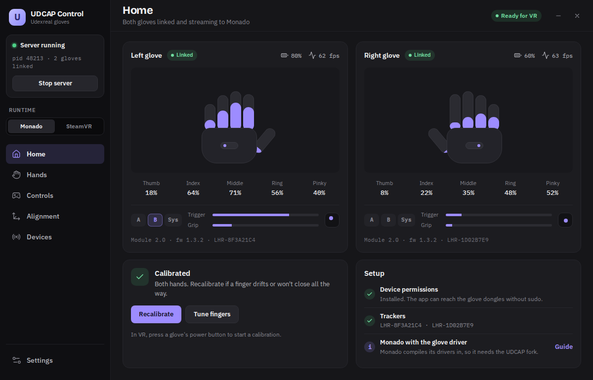

<div align="center">

# 🧤 UDCAP Control

**Use your UDCAP VR gloves on Linux, for Monado and SteamVR**



> **AI usage:** This project was developed with AI assistance (Anthropic's Claude), under human direction, testing, and review.

</div>

## What it does

UDCAP Control is the desktop app that sits between your gloves and your VR runtime. It talks to the gloves, keeps them connected, and turns them into a pair of Index-style controllers with full finger tracking.

- **Works with Monado and SteamVR.** Pick your runtime with one toggle. SteamVR users get the driver installed on first launch. Monado users run the [Monado fork](https://github.com/Eidenz/Monado) that has the glove driver built in.
- **Guided calibration.** Start it from the app or with the glove's power button, and follow the audio cues.
- **Fine-tune each finger.** Live readouts with draggable handles for every finger's range, plus overall curl strength and finger splay.
- **Make the gloves feel like controllers.** Remap A, B, System and the stick on a picture of the glove. Choose which finger drives the trigger and which drives the grip. Calibrate the thumbstick. Test the vibration.
- **Fix the hand position per game.** Alignment profiles hold the position and rotation offsets for each hand, so VRChat and your other games can each have their own. Switch profiles live.
- **Pair and stay connected.** Pair gloves to their receivers, change the radio channel to dodge interference, and let the app reconnect a glove that was switched off and on again.

If a finger ever refuses to track, Settings has a hidden debug page with a guided range test and a report you can share.

## Requirements

- **Linux.** Packages are built for Debian/Ubuntu, Fedora, Arch and as an AppImage.
- **UDCAP gloves** with their USB receivers.
- **SteamVR**, or a **Monado** built from the [fork](https://github.com/Eidenz/Monado). Stock Monado does not include the glove driver, because Monado compiles its drivers in. The app has a step-by-step guide for this, whether you use [Monadeck](https://github.com/Eidenz/monadeck), Envision or your own build.

> **WiVRn is not supported yet.** WiVRn ships its own built-in Monado, so the glove driver cannot be added to it the way it is to the fork. Standalone headsets streaming through WiVRn will not see the gloves for now. A WiVRn fork support is planned.

## Install

Grab the `.deb`, `.rpm` or `.AppImage` from the [releases page](https://github.com/Eidenz/UDCAP-control/releases). Arch users can build the package from [`packaging/arch/`](packaging/arch/).

## Using it

1. Plug in the receivers and switch the gloves on.
2. Open the app. On the **Status** page, accept the device permissions prompt once so the app can talk to the receivers.
3. Choose **Monado** or **SteamVR** with the runtime toggle. For SteamVR, press **Install** when the app offers the driver. For Monado, follow the guide in Settings if you have not set up the fork yet.
4. Go to **Calibrate** and follow the three poses. Your fingers now track.
5. Start your runtime. Launch UDCAP Control before SteamVR, so the driver can find the gloves.

The **Fingers**, **Controls** and **Space** pages are there when something needs tuning. Nothing there is required to get going.

## Troubleshooting

**My gloves are not detected in Monado.** Make sure you are running the [fork](https://github.com/Eidenz/Monado), and that your trackers are paired and connected. You should see the trackers and the "UDCAP" gloves in Monado's device list.

**My gloves are not detected in SteamVR.** Launch UDCAP Control before SteamVR, or restart SteamVR with the app open.

**A glove stopped responding after I switched it off.** The app resets the receiver and picks the glove back up on its own. Give it a few seconds.

**My hands sit in the wrong place or point the wrong way.** Open the **Space** page and adjust the offsets for that hand. Save them into a profile named after the game.

**One finger won't track or moves the wrong way.** Run calibration again, keeping the glove snug and each finger still during the fist pose. If it persists, open the debug page from Settings and send the report.

## Development

The app is a Tauri 2 + SvelteKit (Svelte 5) project. It bundles two binaries built from [UDCAP-server](https://github.com/Eidenz/UDCAP-server): the server that reads the gloves, and the SteamVR driver. Clone that repo in a folder next to this one, then:

```bash
pnpm install
./sync-server.sh        # build and bundle UDCAP-server (once)
./sync-steamvr.sh       # build and bundle the SteamVR driver (once)
pnpm tauri dev
```

`pnpm tauri build` produces the deb, rpm and AppImage packages. The server publishes glove state through shared memory, which both the Monado driver and the SteamVR driver read. The app supervises the server, reads the same memory for its live displays, and writes your offsets, mappings and commands back. An Envision profile for the Monado fork lives in [`extras/envision/`](extras/envision/).

Releases are built by CI, on Debian 12 so they also run on older distros: push a version tag (`v0.7` for 0.7.0) and it drafts the GitHub release. It builds the UDCAP-server commit that the sync scripts record in `.github/udcap-server.ref`, so push UDCAP-server and commit that file first. Releases ship the voice cues in `packaging/sounds/`.

## Credits

UDCAP glove decoding by the **OldestNova** team (Community Hand Driver Core, MIT). **Valve** for OpenVR, SteamVR and the hand-skeleton sample. [**Monado**](https://gitlab.freedesktop.org/monado/monado) (OpenXR runtime).

## License

MIT.
